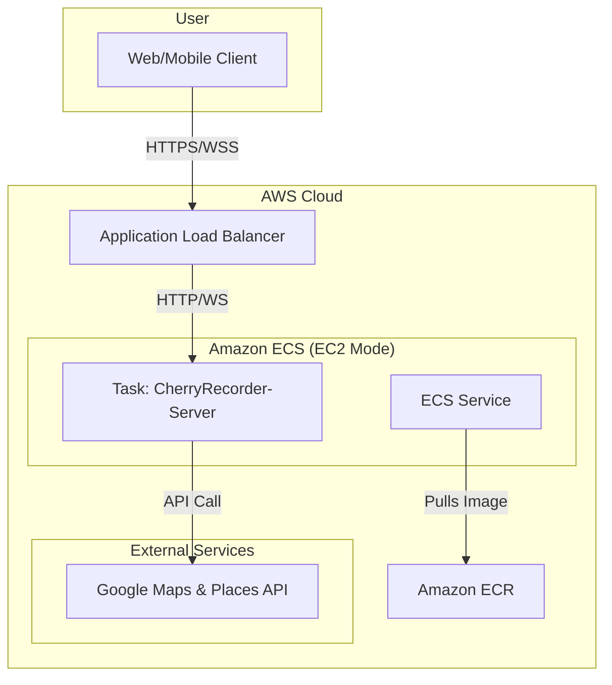

# 🍒 CherryRecorder-Server

[](https://github.com/kugorang/CherryRecorder-Server/actions/workflows/main-ci-cd.yml)
[](https://kugorang.github.io/CherryRecorder-Server/)
[](LICENSE.txt)
[](https://en.cppreference.com/w/cpp/20)
[](https://cmake.org/)
[](https://www.docker.com/)

C++20과 Boost.Beast 프레임워크로 구현된 CherryRecorder의 고성능 백엔드 서버입니다. 위치 기반 서비스와 실시간 채팅 기능을 제공합니다.

## 📋 목차

- [프로젝트 소개](#-프로젝트-소개)
- [아키텍처](#-아키텍처)
- [시작하기](#-시작하기)
- [개발 환경 설정](#-개발-환경-설정)
- [실행 방법](#-실행-방법)
- [API 문서](#-api-문서)
- [CI/CD](#-cicd)
- [배포](#-배포)
- [테스트](#-테스트)
- [문제 해결](#-문제-해결)

## 📱 프로젝트 소개

CherryRecorder Server는 Flutter 클라이언트 앱을 위한 백엔드 시스템입니다. 사용자의 위치 기반 혜택 정보를 관리하고, 실시간 채팅 서비스를 제공하는 고성능 서버입니다. Boost.Beast 프레임워크를 기반으로 하여 뛰어난 성능과 확장성을 제공합니다.

### 주요 기능

1.  **🌐 고성능 HTTP/WebSocket 서버**
    - Boost.Beast 기반의 멀티스레드 I/O 처리
    - `/health` 헬스체크 엔드포인트
    - SSL/TLS 암호화 지원 (HTTPS/WSS)

2.  **🗺️ Google Places API 프록시**
    - 클라이언트의 API 키 노출 없이 안전하게 Google Places API 사용
    - `/places/nearby`: 주변 장소 검색
    - `/places/search`: 텍스트 기반 장소 검색
    - `/places/details`: 장소 상세 정보

3.  **💬 실시간 채팅 서버**
    - WebSocket 기반 양방향 통신
    - 닉네임 기반 사용자 관리 및 채팅방 기능
    - 파일 시스템 기반 채팅 히스토리 저장

## 🏗️ 아키텍처 (AWS ECS 기반)



### 기술 스택

-   **Language**: C++20
-   **Core Framework**: Boost.Beast, Boost.Asio
-   **Build System**: CMake 3.20+, vcpkg
-   **Package Manager**: vcpkg
-   **Libraries**: OpenSSL, spdlog, nlohmann/json
-   **Containerization**: Docker
-   **Orchestration**: Amazon ECS on EC2
-   **CI/CD**: GitHub Actions

## 🚀 시작하기

### 사전 요구사항

-   CMake 3.20 이상
-   C++20 지원 컴파일러 (GCC 11+, Clang 13+, MSVC 2019+)
-   vcpkg 패키지 매니저
-   Google Maps API 키

### 빠른 시작 (로컬)

```bash
# 이 저장소를 클론합니다.
git clone --recursive https://github.com/kugorang/CherryRecorder-Server.git
cd CherryRecorder-Server

# 환경 변수 파일을 생성하고 API 키를 입력합니다.
cp .env.example .env
# nano .env

# 빌드 및 실행 (스크립트 사용)
# Windows
./local_build_and_run.bat
# Linux/macOS
chmod +x ./local_build_and_run.sh
./local_build_and_run.sh
```

## ⚙️ 개발 환경 설정

### 1. vcpkg 설정

프로젝트는 vcpkg를 서브모듈로 포함하고 있습니다.

```bash
# vcpkg 서브모듈 초기화
git submodule update --init --recursive

# vcpkg 부트스트랩 (Windows)
./vcpkg/bootstrap-vcpkg.bat

# vcpkg 부트스트랩 (Linux/macOS)
./vcpkg/bootstrap-vcpkg.sh
```

### 2. 환경 변수

`.env` 파일을 생성하여 아래 변수들을 설정합니다.

```env
# Google Maps API 키 (필수)
GOOGLE_MAPS_API_KEY=your_api_key_here

# 서버 설정 (선택사항 - 기본값 있음)
HTTP_PORT=8080
HTTPS_PORT=58080 # Boost.Beast HTTPS, 현재는 비활성화
WS_PORT=33334
THREADS=8

# SSL 설정 (자체 서명 인증서로 HTTPS 활성화 시)
SSL_CERT_PATH=./ssl/cert.pem
SSL_KEY_PATH=./ssl/key.pem

# 채팅 히스토리 경로
HISTORY_DIR=./history
```

### 3. IDE 설정

-   **Visual Studio Code**: C/C++ 및 CMake Tools 확장 프로그램을 설치하면 자동으로 빌드 환경이 구성됩니다.
-   **Visual Studio 2019/2022**: "Open a local folder" 기능으로 프로젝트를 열면 `CMakeLists.txt`가 자동으로 인식됩니다.

## 🏃‍♂️ 실행 방법

### 로컬 빌드 및 실행

```bash
# Release 모드로 빌드
cmake -S . -B build -DCMAKE_BUILD_TYPE=Release -D CMAKE_TOOLCHAIN_FILE=./vcpkg/scripts/buildsystems/vcpkg.cmake

# 빌드 실행
cmake --build build

# 서버 실행
./build/CherryRecorder-App
```

### Docker 실행

로컬 환경에서 Docker를 사용하여 서버를 실행할 수 있습니다.

```bash
# Docker 이미지 빌드
docker build -t cherryrecorder-server .

# Docker 컨테이너 실행
docker run -p 8080:8080 -p 33334:33334 \
  --env-file .env \
  --name cherry-server \
  cherryrecorder-server
```

## 🚢 배포

이 서버는 AWS ECS(Elastic Container Service)에 EC2 모드로 배포되도록 설계되었습니다.

-   **CI/CD**: `.github/workflows/`의 GitHub Actions 워크플로우가 main 브랜치 푸시 시 Docker 이미지를 빌드하여 Amazon ECR에 푸시합니다.
-   **Task Definition**: `task-definition.json.template`는 ECS 배포를 위한 템플릿입니다. Boost.Beast의 안정성을 위해 `awsvpc` 네트워크 모드, EC2 타입, 최적화된 `ulimits` 및 환경 변수 설정이 포함되어 있습니다.
-   **서비스 생성**: ECR의 이미지를 사용하여 ECS 서비스를 생성하고 Application Load Balancer(ALB)와 연동합니다.

## ⚠️ 문제 해결

### ECS EC2 환경에서의 이벤트 루프 이슈

-   **문제점**: Boost.Asio의 기본 이벤트 메커니즘(`epoll`)이 일부 ECS 환경에서 `Function not implemented` 오류를 발생시키며 비정상 종료되는 현상이 있었습니다.
-   **해결책**: libevent의 백엔드를 `poll`로 설정하여 해결했습니다.

## 📄 라이선스

이 프로젝트는 BSD 3-Clause 라이선스 하에 배포됩니다. 자세한 내용은 [LICENSE.txt](LICENSE.txt) 파일을 참조하세요.

## 🤝 기여하기

프로젝트에 기여하고 싶으시다면 언제든지 Pull Request를 보내주시거나 이슈를 등록해주세요.

1.  Fork the Project
2.  Create your Feature Branch (`git checkout -b feature/AmazingFeature`)
3.  Commit your Changes (`git commit -m 'Add some AmazingFeature'`)
4.  Push to the Branch (`git push origin feature/AmazingFeature`)
5.  Open a Pull Request

## 📞 문의

-   **김현우 (Hyeonwoo Kim)** - Project Lead & Full-Stack Developer
-   **GitHub Issues**: [https://github.com/kugorang/CherryRecorder-Server/issues](https://github.com/kugorang/CherryRecorder-Server/issues)
-   **Email**: `ialskdji@gmail.com`
