# 🍒 CherryRecorder-Server

[](https://github.com/kugorang/CherryRecorder-Server/actions/workflows/main-ci-cd.yml)
[](https://kugorang.github.io/CherryRecorder-Server/)
[](LICENSE.txt)
[](https://en.cppreference.com/w/cpp/20)
[](https://cmake.org/)
[](https://www.docker.com/)

C++20과 Boost.Beast 프레임워크로 구현된 CherryRecorder의 고성능 백엔드 서버입니다. 위치 기반 서비스와 실시간 채팅 기능을 제공합니다.

## 📋 목차

- [프로젝트 소개](#-프로젝트-소개)
- [아키텍처](#-아키텍처)
- [시작하기](#-시작하기)
- [개발 환경 설정](#-개발-환경-설정)
- [실행 방법](#-실행-방법)
- [API 문서](#-api-문서)
- [최적화](#-최적화)
- [CI/CD](#-cicd)
- [배포](#-배포)
- [테스트](#-테스트)
- [문서화](#-문서화)
- [문제 해결](#-문제-해결)

## 📱 프로젝트 소개

CherryRecorder Server는 Flutter 클라이언트 앱을 위한 백엔드 시스템입니다. 사용자의 위치 기반 혜택 정보를 관리하고, 실시간 채팅 서비스를 제공하는 고성능 서버입니다. Boost.Beast 프레임워크를 기반으로 하여 뛰어난 성능과 확장성을 제공합니다.

### 주요 기능

1.  **🌐 고성능 HTTP/WebSocket 서버**
    - Boost.Beast 기반의 멀티스레드 I/O 처리
    - `/health` 헬스체크 엔드포인트
    - SSL/TLS 암호화 지원 (HTTPS/WSS)

2.  **🗺️ Google Places API 프록시**
    - 클라이언트의 API 키 노출 없이 안전하게 Google Places API 사용
    - `/places/nearby`: 주변 장소 검색 (거리순 정렬)
    - `/places/search`: 텍스트 기반 장소 검색
    - `/places/details/{place_id}`: 장소 상세 정보
    - `/places/photo/{photo_reference}`: 장소 사진

3.  **💬 실시간 채팅 서버**
    - WebSocket 기반 양방향 통신
    - 닉네임 기반 사용자 관리 및 채팅방 기능
    - 파일 시스템 기반 채팅 히스토리 저장

## 🏗️ 아키텍처

```mermaid
graph TD
    subgraph "User"
        U[Web/Mobile Client]
    end

    subgraph "AWS Cloud"
        NLB[Network Load Balancer<br/>TLS:58080→8080<br/>TCP:33335]
        subgraph "Amazon ECS (EC2 Mode)"
            ECS[ECS Service<br/>t2.micro]
            T[Task: CherryRecorder-Server<br/>CPU:768 MEM:768MB]
        end
        ECR[Amazon ECR]
        subgraph "External Services"
            G[Google Maps & Places API]
        end
    end

    U -- HTTPS(58080)/WSS(33335) --> NLB
    NLB -- HTTP(8080)/WS(33335) --> T
    ECS -- Pulls Image --> ECR
    T -- API Call --> G
```



### 기술 스택

-   **Language**: C++20
-   **Core Framework**: Boost.Beast, Boost.Asio
-   **Build System**: CMake 3.20+, vcpkg
-   **Package Manager**: vcpkg
-   **Libraries**: OpenSSL, spdlog, nlohmann/json, fmt
-   **Documentation**: Doxygen
-   **Containerization**: Docker
-   **Orchestration**: Amazon ECS on EC2
-   **CI/CD**: GitHub Actions

## 🚀 시작하기

### 사전 요구사항

-   CMake 3.20 이상
-   C++20 지원 컴파일러 (GCC 11+, Clang 13+, MSVC 2019+)
-   vcpkg 패키지 매니저
-   Google Maps API 키

### 빠른 시작 (로컬)

```bash
# 이 저장소를 클론합니다.
git clone --recursive https://github.com/kugorang/CherryRecorder-Server.git
cd CherryRecorder-Server

# 환경 변수 파일을 생성하고 API 키를 입력합니다.
cp .env.example .env
# nano .env

# 빌드 및 실행 (스크립트 사용)
# Windows
./local_build_and_run.bat
# Linux/macOS
chmod +x ./local_build_and_run.sh
./local_build_and_run.sh
```

## ⚙️ 개발 환경 설정

### 1. vcpkg 설정

프로젝트는 vcpkg를 서브모듈로 포함하고 있습니다.

```bash
# vcpkg 서브모듈 초기화
git submodule update --init --recursive

# vcpkg 부트스트랩 (Windows)
./vcpkg/bootstrap-vcpkg.bat

# vcpkg 부트스트랩 (Linux/macOS)
./vcpkg/bootstrap-vcpkg.sh
```

### 2. 환경 변수

`.env` 파일을 생성하여 아래 변수들을 설정합니다.

```env
# Google Maps API 키 (필수)
GOOGLE_MAPS_API_KEY=your_api_key_here

# 서버 설정 (선택사항 - 기본값 있음)
HTTP_PORT=8080
WS_PORT=33334
WSS_PORT=33335     # 프로덕션용 보안 WebSocket

# 스레드 설정 (t2.micro 최적화)
HTTP_THREADS=2     # HTTP 요청 처리 스레드
CHAT_THREADS=2     # WebSocket 처리 스레드

# 로그 레벨
LOG_LEVEL=WARNING  # DEBUG, INFO, WARNING, ERROR

# SSL 설정 (자체 서명 인증서로 HTTPS 활성화 시)
SSL_CERT_PATH=./ssl/cert.pem
SSL_KEY_PATH=./ssl/key.pem

# 채팅 히스토리 경로
HISTORY_DIR=./history
```

### 3. IDE 설정

-   **Visual Studio Code**: C/C++ 및 CMake Tools 확장 프로그램을 설치하면 자동으로 빌드 환경이 구성됩니다.
-   **Visual Studio 2019/2022**: "Open a local folder" 기능으로 프로젝트를 열면 `CMakeLists.txt`가 자동으로 인식됩니다.

## 📡 API 문서

### HTTP 엔드포인트

#### 1. 헬스체크
```http
GET /health
```
**응답:**
```json
{
  "status": "healthy"
}
```

#### 2. 주변 장소 검색
```http
POST /nearbySearch
Content-Type: application/json

{
  "latitude": 37.4979,
  "longitude": 127.0276,
  "radius": 500
}
```
**응답:**
```json
{
  "places": [
    {
      "id": "ChIJ...",
      "name": "스타벅스 강남역점",
      "addr": "서울특별시 강남구...",
      "loc": {
        "lat": 37.498095,
        "lng": 127.027610
      }
    }
  ]
}
```
- 최대 5개 결과 반환 (클라이언트 표시 개수에 최적화)
- `rankPreference: DISTANCE`로 거리순 정렬

#### 3. 텍스트 검색
```http
POST /textSearch
Content-Type: application/json

{
  "query": "강남역 카페",
  "latitude": 37.4979,
  "longitude": 127.0276,
  "radius": 5000
}
```
**응답:** 주변 장소 검색과 동일한 형식

#### 4. 장소 상세 정보
```http
GET /placeDetails/{place_id}
```
**응답:** Google Places API의 상세 정보 그대로 반환

#### 5. 장소 사진
```http
GET /placePhoto/{photo_reference}
```
**응답:** 이미지 바이너리 데이터

### WebSocket 프로토콜

**연결:** `ws://host:33334` 또는 `wss://host:33335`

**메시지 형식:**
```json
// 클라이언트 → 서버
{
  "type": "join",      // join, message
  "placeId": "ChIJ...",
  "nickname": "사용자1",
  "message": "안녕하세요"
}

// 서버 → 클라이언트
{
  "type": "message",   // message, history, error
  "user": "사용자1",
  "message": "안녕하세요",
  "timestamp": "2024-01-10T10:30:00"
}
```

## ⚡ 최적화

### t2.micro 인스턴스 최적화 설정

서버는 AWS t2.micro (1 vCPU, 1GB RAM) 환경에서 안정적으로 동작하도록 최적화되어 있습니다:

1. **리소스 할당**
   - CPU: 768 (0.75 vCPU) - OS/ECS용 0.25 vCPU 예약
   - Memory: 768MB - OS/ECS용 256MB 예약
   - Memory Reservation: 512MB

2. **스레드 최적화**
   - HTTP_THREADS: 2 (기본값 4에서 축소)
   - CHAT_THREADS: 2 (기본값 4에서 축소)

3. **로그 최적화**
   - 프로덕션 로그 레벨: WARNING
   - 불필요한 디버그 로그 제거
   - 오류 로그 크기 제한 (요청 본문 대신 길이만 출력)

4. **API 응답 최적화**
   - 장소 검색 결과: 10개 → 5개로 축소
   - 네트워크 트래픽 50% 감소

## 🏃‍♂️ 실행 방법

### 로컬 빌드 및 실행

```bash
# Release 모드로 빌드
cmake -S . -B build -DCMAKE_BUILD_TYPE=Release \
  -DCMAKE_TOOLCHAIN_FILE=./vcpkg/scripts/buildsystems/vcpkg.cmake

# 빌드 실행
cmake --build build

# 서버 실행
./build/CherryRecorder-App
```

### Docker 실행

```bash
# Docker 이미지 빌드
docker build -t cherryrecorder-server .

# Docker 컨테이너 실행
docker run -p 8080:8080 -p 33334:33334 -p 33335:33335 \
  --env-file .env \
  --name cherry-server \
  cherryrecorder-server
```

## 📖 문서화

### Doxygen 문서 생성

프로젝트는 Doxygen을 사용하여 코드 문서를 자동 생성합니다:

```bash
# Doxygen 설치 (Ubuntu/Debian)
sudo apt-get install doxygen graphviz

# 문서 생성
cd docs
doxygen Doxyfile

# 생성된 문서 확인
open docs_output/html/index.html
```

**온라인 문서:** [https://kugorang.github.io/CherryRecorder-Server/](https://kugorang.github.io/CherryRecorder-Server/)

### 문서 구조
- **Classes:** 모든 클래스의 계층 구조 및 멤버 함수
- **Files:** 소스 파일별 함수 및 변수
- **Namespaces:** 네임스페이스별 구성 요소

## 🧪 테스트

```bash
# 테스트 빌드 및 실행
cmake -S . -B build -DBUILD_TESTS=ON
cmake --build build
cd build && ctest
```

### 테스트 커버리지
- **단위 테스트:** Google Test 프레임워크 사용
- **통합 테스트:** API 엔드포인트 및 WebSocket 통신
- **부하 테스트:** Apache Bench (ab) 및 wscat 활용

## 🚀 CI/CD

### GitHub Actions 워크플로우

1. **자동 빌드 및 테스트**
   - PR 생성 시 자동 빌드 및 테스트 실행
   - 다중 플랫폼 지원 (Linux, Windows, macOS)

2. **Docker 이미지 빌드**
   - main 브랜치 푸시 시 자동 빌드
   - Amazon ECR에 이미지 푸시

3. **ECS 배포**
   - 새 이미지로 ECS 서비스 자동 업데이트
   - Blue/Green 배포 전략

## 🚢 배포

### AWS ECS 배포 구성

1. **Network Load Balancer (NLB)**
   - TLS 리스너 (58080) → HTTP 타겟 (8080)
   - TCP 리스너 (33335) → WS 타겟 (33335)

2. **ECS Task Definition**
   - EC2 인스턴스 타입: t2.micro
   - 네트워크 모드: awsvpc
   - 헬스체크: `/health` 엔드포인트

3. **Auto Scaling**
   - 최소 태스크: 1
   - 최대 태스크: 2
   - CPU 사용률 기반 스케일링

## ⚠️ 문제 해결

### 1. ECS 환경 이벤트 루프 이슈
-   **문제**: Boost.Asio의 `epoll` 이벤트 메커니즘 오류
-   **해결**: 환경 변수로 `poll` 백엔드 설정

### 2. t2.micro 리소스 부족
-   **문제**: 메모리/CPU 부족으로 헬스체크 실패
-   **해결**: 리소스 할당 최적화 및 스레드 수 조정

### 3. Google Places API 연결 실패
-   **문제**: `Cannot assign requested address [99]`
-   **해결**: 재시도 로직 추가 (최대 3회, 지수 백오프)

## 📄 라이선스

이 프로젝트는 BSD 3-Clause 라이선스 하에 배포됩니다. 자세한 내용은 [LICENSE.txt](LICENSE.txt) 파일을 참조하세요.

## 🤝 기여하기

프로젝트에 기여하고 싶으시다면 언제든지 Pull Request를 보내주시거나 이슈를 등록해주세요.

1.  Fork the Project
2.  Create your Feature Branch (`git checkout -b feature/AmazingFeature`)
3.  Commit your Changes (`git commit -m 'Add some AmazingFeature'`)
4.  Push to the Branch (`git push origin feature/AmazingFeature`)
5.  Open a Pull Request

## 📞 문의

-   **김현우 (Hyeonwoo Kim)** - Project Lead & Full-Stack Developer
-   **GitHub Issues**: [https://github.com/kugorang/CherryRecorder-Server/issues](https://github.com/kugorang/CherryRecorder-Server/issues)
-   **Email**: `ialskdji@gmail.com`
