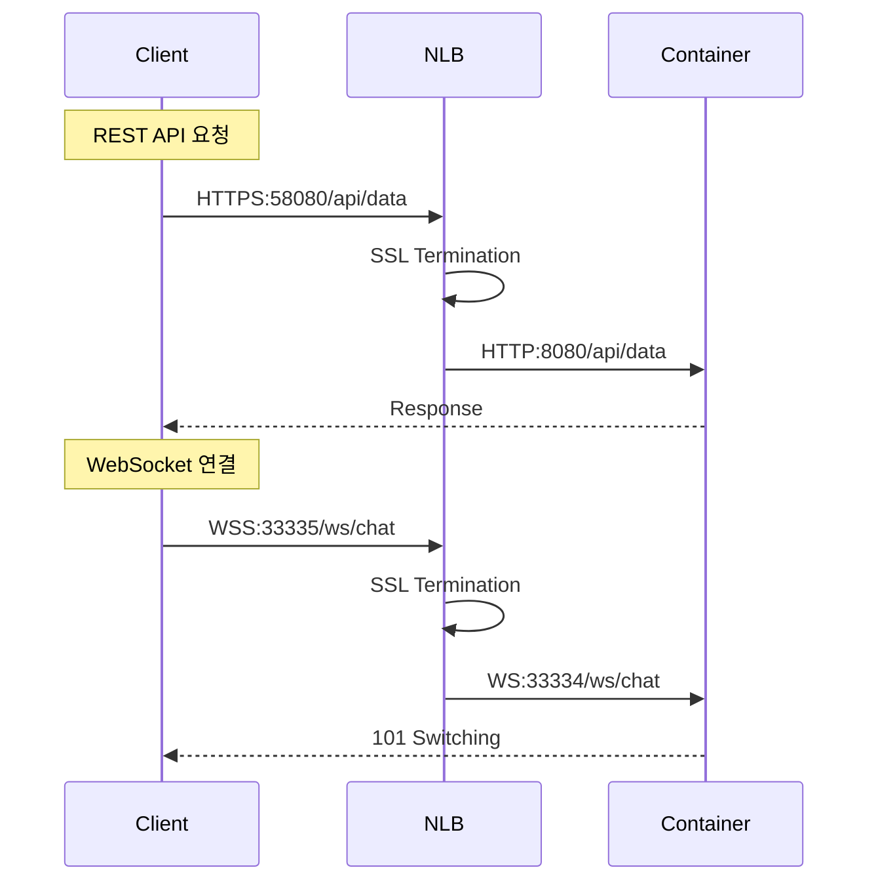

# NLB 포트 분리 아키텍처 설명

## 🎯 왜 포트를 분리해야 하는가?

### 1. **Network Load Balancer(NLB)의 특성**

NLB는 **Layer 4 (전송 계층)** 로드 밸런서입니다. 이는 다음을 의미합니다:

```
OSI 7계층 모델:
7. Application (HTTP, WebSocket)  ← ALB가 이해하는 레벨
6. Presentation
5. Session
4. Transport (TCP, UDP)          ← NLB가 작동하는 레벨
3. Network (IP)
2. Data Link
1. Physical
```

**NLB는 TCP/UDP 패킷만 봅니다. HTTP 헤더나 URL 경로를 볼 수 없습니다!**

### 2. **포트별 트래픽 구분의 장점**

#### 독립적인 서비스 관리
```
HTTPS:58080 → HTTP:8080   (REST API)
WSS:33335   → WS:33334    (WebSocket)
```

각 서비스가 독립적으로:
- **모니터링**: CloudWatch에서 포트별 메트릭 확인 가능
- **스케일링**: API와 WebSocket 서버를 독립적으로 스케일
- **보안**: 포트별로 다른 보안 규칙 적용
- **디버깅**: 문제 발생 시 어느 서비스인지 즉시 파악

### 3. **실제 동작 과정**

#### 포트 분리 시 (권장) ✅


#### 단일 포트(443) 사용 시 문제점 ❌
```
Client → NLB:443 → ??? 
         ↓
   "이게 HTTP인가 WebSocket인가?"
   NLB는 모름! (Layer 4라서)
```

### 4. **포트 443을 공유하려면?**

#### 방법 1: ALB 사용 (비추천)
```
Client → ALB:443 → Path 기반 라우팅
                    ├─ /api/* → Target Group 1
                    └─ /ws/*  → Target Group 2
```
**단점:**
- ALB는 비용이 더 높음 (시간당 $0.0225 vs NLB $0.0225)
- 데이터 처리 비용 추가 (GB당 $0.008)
- WebSocket 연결 제한 (4000개/AZ)
- 높은 레이턴시

#### 방법 2: 프록시 서버 추가 (매우 비추천)
```
Client → NLB:443 → Nginx/HAProxy → 분기
                                    ├─ HTTP:8080
                                    └─ WS:33334
```
**단점:**
- 추가 인프라 필요
- 단일 장애점 추가
- 성능 오버헤드

### 5. **비용 비교**

#### 포트 분리 (NLB)
```
기본 요금: $0.0225/시간
연결 비용: LCU 기반 (매우 저렴)
데이터 전송: 추가 비용 없음
```

#### ALB 사용 시
```
기본 요금: $0.0225/시간
LCU 비용: $0.008/LCU
데이터 처리: $0.008/GB (추가!)
```

월 1TB 트래픽 기준:
- NLB: ~$16.20
- ALB: ~$24.20 (50% 더 비쌈)

### 6. **보안 측면**

#### 포트 분리의 보안 이점
```yaml
# 세밀한 보안 그룹 규칙
NLB Security Group:
  - 58080/tcp from 0.0.0.0/0  # HTTPS API
  - 33335/tcp from 0.0.0.0/0  # WSS Chat
  
# WAF 규칙도 포트별로 적용 가능
WAF Rules:
  - 58080: API Rate Limiting
  - 33335: WebSocket Connection Limits
```

### 7. **트러블슈팅 예시**

#### 문제: "WebSocket이 간헐적으로 끊김"

**포트 분리 시:**
```bash
# WSS 포트만 확인
aws cloudwatch get-metric-statistics \
  --metric-name ActiveConnectionCount \
  --dimensions Name=LoadBalancer,Value=app/my-nlb/xxx \
               Name=TargetGroup,Value=targetgroup/ws-tg/xxx \
  --statistics Average
```
→ WebSocket만의 문제인지 즉시 확인 가능

**단일 포트 시:**
- HTTP와 WebSocket 트래픽이 섞여서 문제 원인 파악 어려움
- 전체 서비스 재시작해야 할 수도...

## 📌 결론

**포트를 분리하세요!** 이유:

1. **명확성**: 각 서비스의 역할이 분명
2. **관리성**: 독립적인 모니터링과 스케일링
3. **성능**: NLB의 Layer 4 특성 활용
4. **비용**: ALB보다 저렴
5. **보안**: 세밀한 접근 제어
6. **디버깅**: 문제 파악이 쉬움

### 최종 권장 설정

```yaml
# GitHub Variables
NLB_HTTP_PORT: 58080      # HTTPS API
NLB_WEBSOCKET_PORT: 33335 # WSS Chat

# 컨테이너 포트 (내부)
HTTP_PORT_VALUE: 8080
WS_PORT_VALUE: 33334
```

이렇게 하면 ECS에서 HTTPS와 WSS가 모두 정상 작동합니다! 🚀
